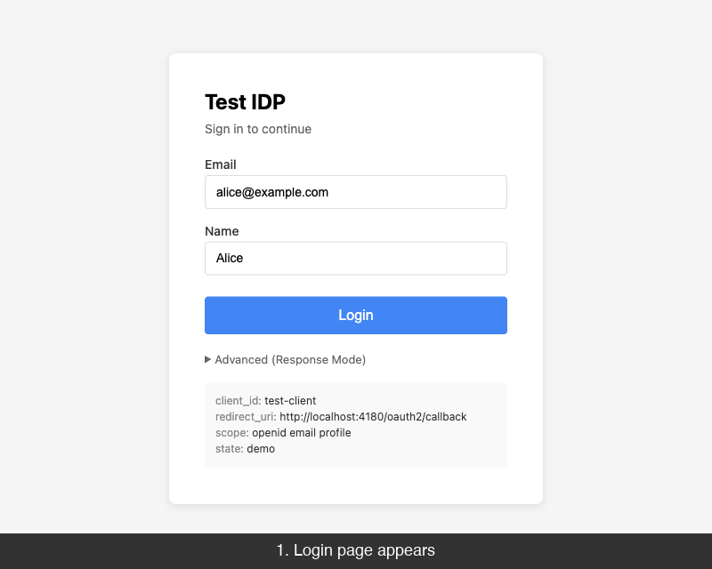

# mock-google-oidc

Google 로그인 테스트용 mock OIDC provider.

실제 Google 계정 없이 로컬에서 Google 로그인 플로우를 테스트합니다.

English: [README.md](README.md)



## 빠른 시작

```bash
docker compose up --build
```

`http://localhost:4180` 접속 → mock 로그인 → nginx upstream 도달.

## 엔드포인트

| 경로 | 용도 |
| --- | --- |
| `/.well-known/openid-configuration` | OIDC Discovery |
| `/o/oauth2/v2/auth` | Authorization (Google 경로) |
| `/token` | Token 교환 |
| `/v1/userinfo` | 사용자 정보 |
| `/oauth2/v3/certs` | JWKS |

## 주요 기능

- Authorization Code + PKCE (`S256`, `plain`)
- RS256 `id_token` + JWKS
- `coreos/go-oidc` conformance 테스트 통과
- Google 호환 경로
- 에러 시뮬레이션 (Deny, Token Error, Userinfo Error)

## 테스트

```bash
go test ./...
```

81개 테스트: 순수 함수 → 핸들러 → 통합 플로우 → OIDC conformance (C1~C7).

## 프로젝트 구조

```
cmd/mock-google-oidc/main.go     # 엔트리포인트
internal/oidc/
  handler.go                     # HTTP 핸들러
  store.go                       # 인메모리 저장소
  jwt.go                         # RSA + JWT
  validate.go                    # 순수 검증 함수
  conformance_test.go            # coreos/go-oidc conformance
docs/                            # 스펙 문서
```

## 문서

[docs/001-overview.md](docs/001-overview.md) 부터 읽으세요.

```
001-overview.md              프로젝트 목표
002-reference-specs.md       기준 스펙
003-endpoints.md             HTTP 계약
004-google-compatibility.md  Google 호환 범위
005-flow.md                  인증 흐름
006-conformance-boundary.md  MUST / SHOULD / 비준수
007-development.md           실행과 개발
```
