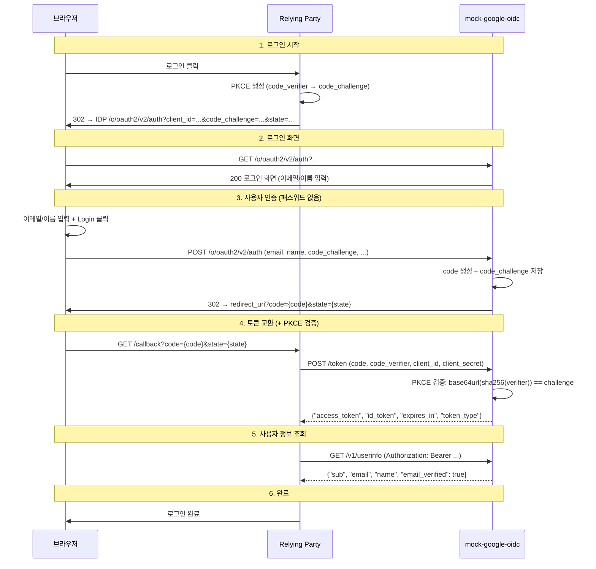

# Spec 004: 전체 흐름

## Google OIDC 호환 플로우

mock-google-oidc는 Google OIDC Authorization Code + PKCE 플로우를 구현한다.
유일한 차이는 로그인 화면에서 패스워드가 없다는 것.

## 시퀀스 다이어그램



## Google 플로우와 비교

| 단계 | Google | mock-google-oidc | 차이 |
|------|--------|-----------------|------|
| Authorization URL | `accounts.google.com/o/oauth2/v2/auth` | `localhost:8082/o/oauth2/v2/auth` | 호스트 |
| 로그인 화면 | 이메일 → 패스워드 → 동의 (3단계) | 이메일 + 이름 → Login (1단계) | **유일한 UX 차이** |
| PKCE | S256, plain 지원 | S256, plain 지원 | 없음 |
| Callback | `redirect_uri?code=...&state=...` | 동일 | 없음 |
| Token 요청 | POST + code + code_verifier | 동일 형식 | 없음 |
| Token 응답 | `{access_token, id_token, ...}` | 동일 형식 | 없음 |
| id_token | RS256 JWT | RS256 JWT | 키만 다름 |
| UserInfo | `{sub, email, name, ...}` | 동일 형식 | 없음 |
| refresh_token | 지원 | **미지원** | |
| client_secret 검증 | 검증함 | **검증 안 함** | |
| HTTPS | 필수 | HTTP (로컬) | |

## sub 규칙

```
sub = fmt.Sprintf("%x", sha256("alice@example.com")[:10])
    = "e3b0c44298fc1c149afb"  // 20자리 hex
```

| 동작 | 설명 |
|------|------|
| 같은 이메일로 재로그인 | 같은 sub → Relying Party가 기존 유저로 인식 |
| 다른 이메일로 로그인 | 다른 sub → Relying Party가 새 유저로 인식 |

## 에러 플로우

### Deny
```
IDP → 302 → redirect_uri?error=access_denied&error_description=The+user+denied+access&state=...
```

### Token Error
```
Relying Party → POST /token → 500 {"error": "server_error"}
```

### Userinfo Error
```
Relying Party → POST /token → 200 정상
Relying Party → GET /v1/userinfo → 500 {"error": "server_error"}
```

## 환경 변수

| 변수 | 기본값 | 설명 |
|------|--------|------|
| `LISTEN_ADDR` | `:8082` | 서버 바인딩 주소 |
| `PUBLIC_URL` | `http://localhost:8082` | issuer, discovery URL |
