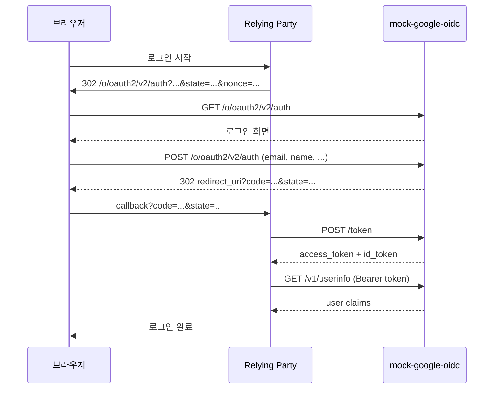

# Spec 005: 전체 흐름

## 핵심 흐름

mock-google-oidc는 `Google 로그인 테스트에 필요한 Authorization Code + PKCE 흐름`을 제공한다.
실제 Google과 가장 큰 차이는 사용자 인증 UI가 매우 단순하다는 점뿐이다.

## 컴포넌트 관계

```text
[브라우저]
    |
    v
[앱 / oauth2-proxy]
    |
    v
[mock-google-oidc]
    |
    +-> 로그인 화면
    +-> code 발급
    +-> token 발급
    +-> userinfo 반환
    `-> jwks 제공
```

## 정상 플로우



## 단계별 의미

### 1. 로그인 시작

앱은 사용자를 Google 스타일 authorize endpoint로 보낸다.

```text
/o/oauth2/v2/auth
  ?client_id=...
  &redirect_uri=...
  &response_type=code
  &scope=openid email profile
  &state=...
  &nonce=...
  &code_challenge=...
```

### 2. mock 로그인 화면

provider는 실제 Google 계정 인증 대신 아래 입력만 받는다.

```text
email
name
response_mode
```

이때 OAuth/OIDC 파라미터는 hidden field로 유지된다.

### 3. authorization code 발급

로그인 성공 시 provider는 아래 정보를 code와 함께 저장한다.

```text
client_id
redirect_uri
scope
nonce
email
name
code_challenge
code_challenge_method
response_mode
```

그 후 브라우저를 원래 앱의 callback으로 돌려보낸다.

### 4. token 교환

앱은 provider에 `POST /token` 요청을 보낸다.

검증 순서:

```text
grant_type 확인
   -> client auth 확인
   -> code 존재 여부 확인
   -> redirect_uri exact match
   -> PKCE 검증
   -> code 소비
   -> access_token / id_token 발급
```

### 5. userinfo 조회

앱은 필요 시 `access_token`으로 userinfo를 조회한다.

보장:
- `userinfo.sub == id_token.sub`
- `email`, `name`, `email_verified`를 포함한다

## `sub` 정책

```text
sub = SHA256(email)[:10] -> 20자리 hex 문자열
```

의도:

```text
같은 이메일
   -> 같은 sub
   -> 앱이 같은 사용자로 인식

다른 이메일
   -> 다른 sub
   -> 앱이 다른 사용자로 인식
```

## 에러 플로우

### Deny

```text
브라우저
  -> POST /o/oauth2/v2/auth (response_mode=deny)
  -> 302 redirect_uri?error=access_denied&state=...
```

### Token Error

```text
로그인 성공
  -> code 발급
  -> POST /token
  -> 500 server_error
```

### Userinfo Error

```text
로그인 성공
  -> token 발급
  -> GET /v1/userinfo
  -> 500 server_error
```
